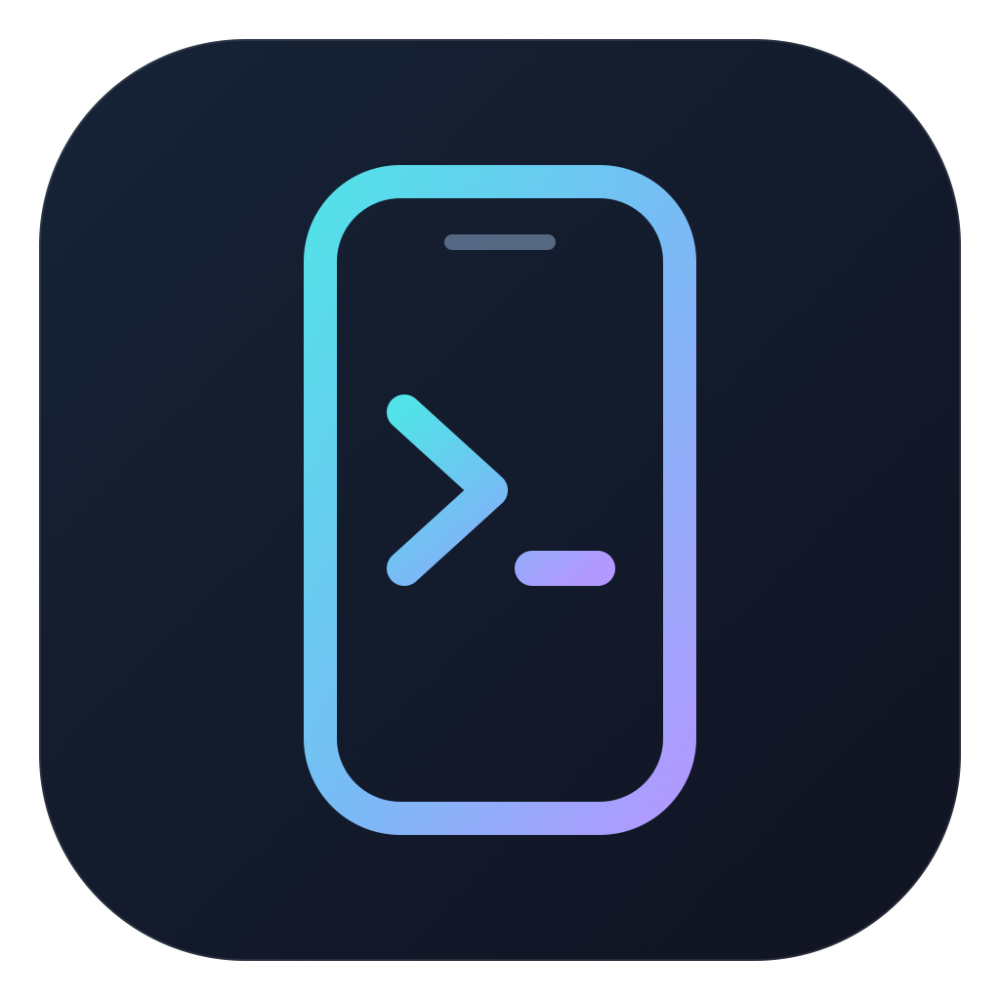
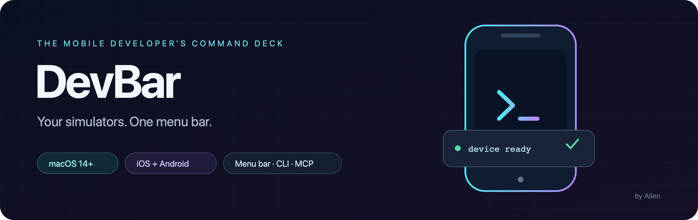
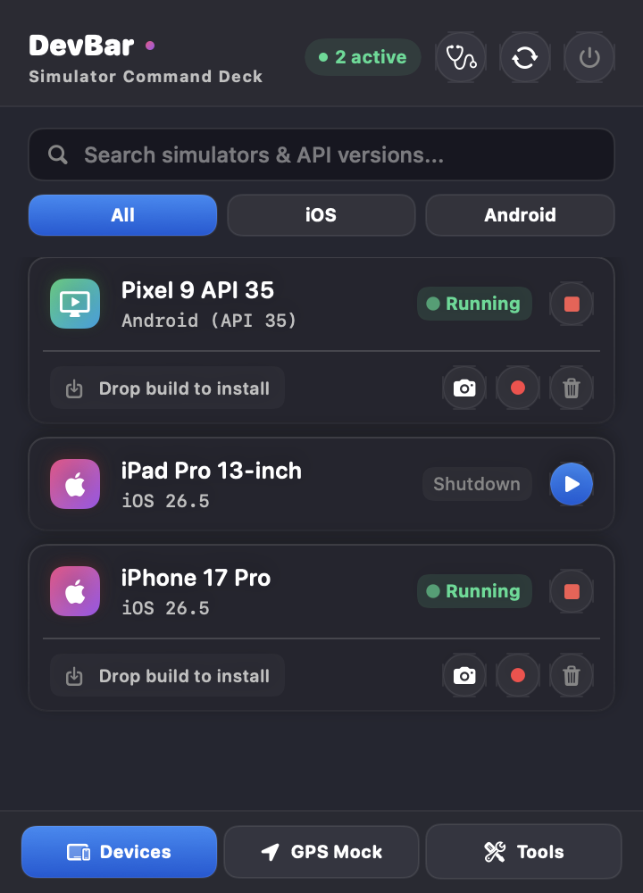
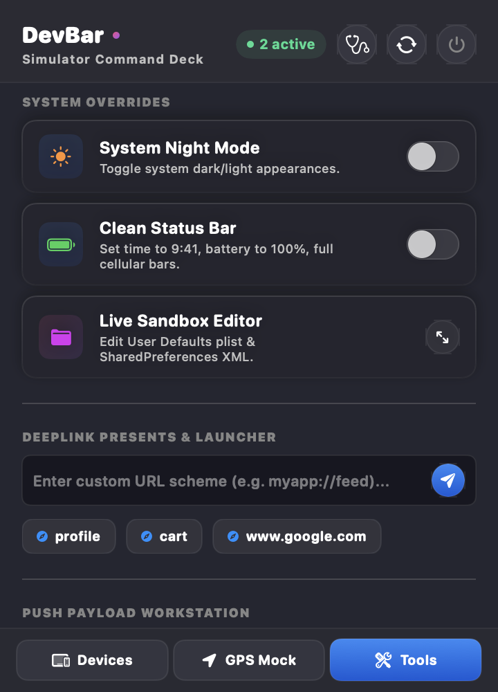

<p align="center">
  
</p>
<h1 align="center">DevBar</h1>



[](https://github.com/all3n2601/DevBar/actions/workflows/ci.yml)
[](https://github.com/all3n2601/DevBar/releases)
[](LICENSE)

A macOS menu bar companion for mobile developers. Boot a simulator, install your latest build, capture a screenshot, or replay a GPS route without switching between development tools. Use the same device operations from your terminal or an AI agent through MCP.

**Public beta · macOS 14+ · Apple Silicon and Intel · Swift · no third-party runtime dependencies.**

## Interface

<p align="center">
  
  
</p>

*Rendered from DevBar’s actual SwiftUI interface using demo devices. Names and running states are illustrative.*

## Install

Download the app ZIP from [Releases](https://github.com/all3n2601/DevBar/releases), unzip it, and move **DevBar.app** to Applications. Launch it and look for the phone-and-terminal icon in the menu bar. **Option + Shift + D** opens the command deck.

Beta downloads are ad-hoc signed, **not Apple Developer ID signed or notarized**. macOS may block first launch. After verifying the download and its source, use **System Settings → Privacy & Security → Open Anyway** if available. You can also build from source. Do not disable Gatekeeper globally.

Each release includes:

- `DevBar-<version>-macos-universal.zip` — menu bar app.
- `DevBar-<version>-cli-macos-universal.tar.gz` — standalone executable, README, and license.
- `DevBar-<version>-SHA256SUMS.txt` — checksums for both archives.

To use the CLI, extract its archive and put the executable in a directory on your PATH, such as `~/.local/bin`. The app bundle also includes the same executable:

```sh
/Applications/DevBar.app/Contents/MacOS/DevBar cli doctor
```

To verify downloaded archives, place them beside the checksum file and run:

```sh
shasum -a 256 -c DevBar-0.2.0-beta.3-SHA256SUMS.txt
```

## Requirements

Only install the tools for the platform you use. DevBar does not bundle SDKs or create device runtimes.

| Platform | Required setup |
| --- | --- |
| iOS | Full Xcode, selected developer directory, and an installed iOS Simulator runtime. Launch Xcode once to finish setup. |
| Android | Android SDK platform-tools (`adb`), Android Emulator, and at least one AVD created in Android Studio. |
| Physical Android | USB debugging enabled and this Mac authorized. Install, launch, screenshots, and deep links are supported; emulator power/GPS controls are unavailable. |

Android SDK lookup checks `ANDROID_SDK_ROOT`, then `ANDROID_HOME`, then `~/Library/Android/sdk`; individual tools can also be found in Homebrew locations or PATH. A Finder-launched app may not inherit your shell environment. The standard SDK location is the easiest setup for the menu bar app.

```sh
DevBar cli doctor
DevBar cli list
```

`doctor` reports each platform separately. Missing Android tools do not prevent iOS use, and vice versa.

## What you can do

| Workflow | Menu bar | CLI / MCP |
| --- | :---: | :---: |
| Discover iOS simulators and Android virtual devices | ✓ | ✓ |
| Boot and shut down virtual devices | ✓ | ✓ |
| Install simulator `.app` / Android `.apk` builds | Drag and drop | ✓ |
| Capture PNG screenshots | Clipboard + temporary file | Saved file path |
| Record screens | ✓ | — |
| Set GPS coordinates | All active virtual devices | One selected device |
| Replay GPX routes | ✓ | — |
| Launch an installed app | Right-click a device | ✓ |
| Open a deep link | One device / active devices | One selected device |
| Check development tool availability | Header diagnostics button | ✓ |
| Toggle appearance / clean status bar | ✓ | — |
| Inject iOS simulator push notifications | ✓ | — |
| Favorite a device / copy its ID | Right-click a device | — |
| Inspect app preferences | Experimental | — |

Favorites are saved locally and appear first in the device list. The device list refreshes when you open the popover or press Refresh. Boot failures appear in the popover instead of silently reporting success.

## CLI

```sh
DevBar --help
DevBar --version
DevBar cli list --json
DevBar cli boot "iPhone 16"
DevBar cli install "iPhone 16" ./Build/MyApp.app
DevBar cli launch "iPhone 16" com.example.myapp
DevBar cli open-url "iPhone 16" 'myapp://account?tab=settings'
DevBar cli location "iPhone 16" 37.7749 -122.4194
DevBar cli screenshot "iPhone 16" ./captures/account.png
DevBar cli shutdown "iPhone 16"
```

Use exact device IDs from `list` when multiple devices share a name. Android IDs are an AVD name when stopped and an `emulator-*` serial when running. After booting an AVD, run `list` again for its active serial.

All commands accept `--json`. Successful mutations return `success`, `command`, and `device`, plus `path` for screenshots. Errors return a JSON error object with a nonzero exit code. Human-readable failures go to stderr. `list --json` returns an array of devices; `doctor --json` returns an array of tool checks.

Boot waits for readiness for up to 180 seconds. Ordinary commands have a 30-second timeout; installation allows 120 seconds. An Android emulator that takes longer to boot stays running so you can inspect it. Screenshots refuse to overwrite an existing file and create missing parent directories.

## MCP integration

Build or install DevBar first. Configure your MCP-compatible client with the **absolute path to the executable**:

```json
{
  "mcpServers": {
    "devbar": {
      "command": "/Applications/DevBar.app/Contents/MacOS/DevBar",
      "args": ["mcp"]
    }
  }
}
```

Available tools: `devbar_list_devices`, `devbar_doctor`, `devbar_boot_device`, `devbar_shutdown_device`, `devbar_take_screenshot`, `devbar_install_app`, `devbar_launch_app`, `devbar_open_url`, and `devbar_set_location`.

Location now requires an explicit device `id`; it does not broadcast to every active simulator. Screenshot results contain the saved absolute path, allowing a client to inspect the file with its own image tools.

The server uses newline-delimited JSON-RPC over stdin/stdout, with subprocess diagnostics on stderr, following the [MCP stdio transport specification](https://modelcontextprotocol.io/specification/2025-06-18/basic/transports). It handles requests sequentially, so a long boot delays later tool calls. Client-side cancellation of a running command is not implemented; process timeouts still apply. Supported protocol versions are `2024-11-05`, `2025-03-26`, and `2025-06-18`.

## Team presets

The menu bar app loads `devbar.config.json` from its current working directory. To select a workspace explicitly, launch the executable with `DEVBAR_CONFIG` set:

```sh
DEVBAR_CONFIG="$PWD/devbar.config.json" /Applications/DevBar.app/Contents/MacOS/DevBar
```

Example configuration:

```json
{
  "gpsPresets": [
    { "name": "Office", "latitude": 37.7749, "longitude": -122.4194, "icon": "building.2.fill" }
  ],
  "pushPayloads": [
    { "name": "Welcome", "bundleId": "com.example.myapp", "payloadString": "{\"aps\":{\"alert\":\"Hello from DevBar\"}}" }
  ]
}
```

Configuration is loaded at startup. Keep credentials and production notification payloads out of committed presets.

## Beta limitations

- **Simulator builds only on iOS.** Device `.ipa` files cannot be installed on iOS Simulators. Physical iOS devices are not supported.
- **Android FCM injection is unsupported.** Android push delivery requires your application's test backend or Firebase tooling; an adb broadcast cannot reliably simulate FCM. DevBar reports this limitation.
- **Preference editing is experimental.** Android app-private storage usually needs a rooted emulator or appropriate debugging permissions. Writes can affect app data; use disposable test devices. iOS preference edits may need an app restart.
- Android recording uses `adb shell screenrecord`, which can stop automatically at the platform's duration limit. Stopping the recording retrieves the video into Downloads. Validate recordings before relying on them in a demo.
- Wiping is supported for iOS simulators only and deletes their data. Use Android Studio Device Manager to reset Android AVDs.
- GUI bulk operations can take time across multiple devices. CLI and MCP provide targeted operations and explicit results.
- Hardware integration needs broader validation across Xcode and Android versions. Unit tests and release smoke checks do not replace device testing.

DevBar itself has no analytics or remote service. It invokes local Apple/Android tools; `adb` may start its normal local server and can communicate with devices you have connected. MapKit in the GPS view can fetch Apple map data.

## Build and test

Requires macOS 14+ and Xcode with Swift 5.9 or newer. The project uses Swift Package Manager; no third-party Swift packages are required.

```sh
git clone https://github.com/all3n2601/DevBar.git
cd DevBar
swift build
swift run DevBar
swift test
python3 scripts/smoke-test.py "$(swift build --show-bin-path)/DevBar"
scripts/package-release.sh
```

The packaging script builds a universal binary for Apple Silicon and Intel, creates an ad-hoc signed `.app`, verifies its architecture and signature, and writes both archives and checksums into `dist/`.

```text
Sources/Core/       Device discovery, commands, process runner, MCP dispatch
Sources/Views/      SwiftUI menu bar interface
Sources/            App lifecycle, UI state, CLI and stdio entry points
Tests/              Process, validation, discovery, and protocol regression tests
scripts/            Packaging and executable smoke checks
.github/workflows/  CI and tag-triggered GitHub Releases
website/            Separate marketing website (not bundled in releases)
```

To regenerate the app icon from the vector logo, run `scripts/generate-icon.sh`. Render the vector logo with `swift scripts/render-svg.swift docs/assets/devbar-logo.svg docs/assets/devbar-logo.png`. Regenerate the banner with `swift scripts/render-svg.swift docs/assets/banner.svg docs/assets/banner.png`. For interface previews, build in debug mode and run:

```sh
"$(swift build --show-bin-path)/DevBar" --capture-docs "$PWD/docs/assets"
```

This renders the interface with demo data without booting or changing devices. The capture command is excluded from release builds.

## Releases and contributions

CI builds, tests, smoke-checks, and packages the app on pushes to `main` and pull requests. Pushing a version tag runs the same checks before publishing release assets. Versions containing a suffix, such as `-beta.1`, publish as prereleases. See [RELEASING.md](RELEASING.md) for the maintainer checklist and notarization requirements.

Bug reports should include macOS, Xcode/Android SDK versions, `DevBar cli doctor` output, and steps to reproduce. See [CONTRIBUTING.md](CONTRIBUTING.md). Please remove private device details and application data from reports.

## License

[MIT](LICENSE) © 2026 M A Allen Febi.
